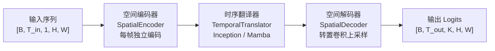
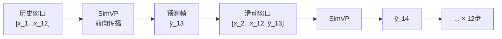
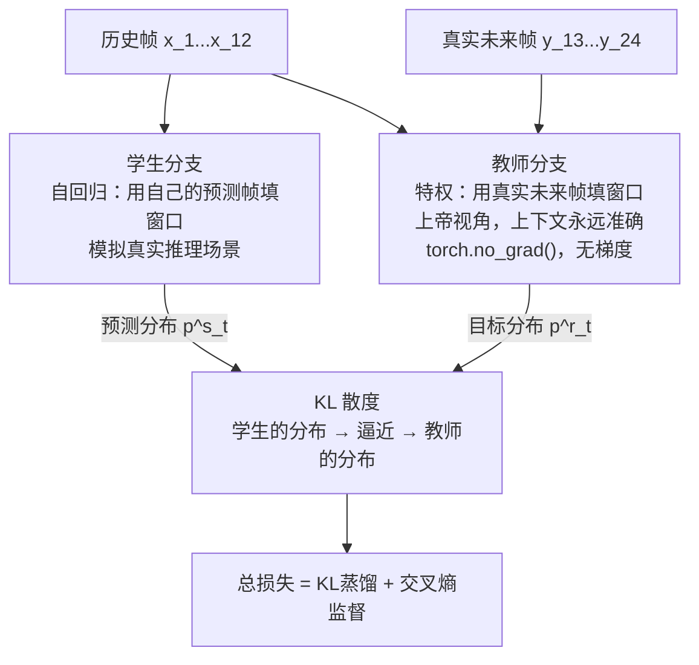
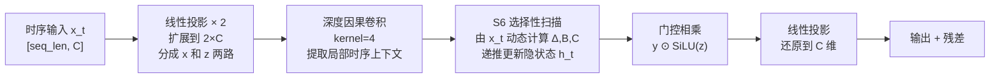
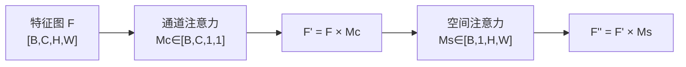
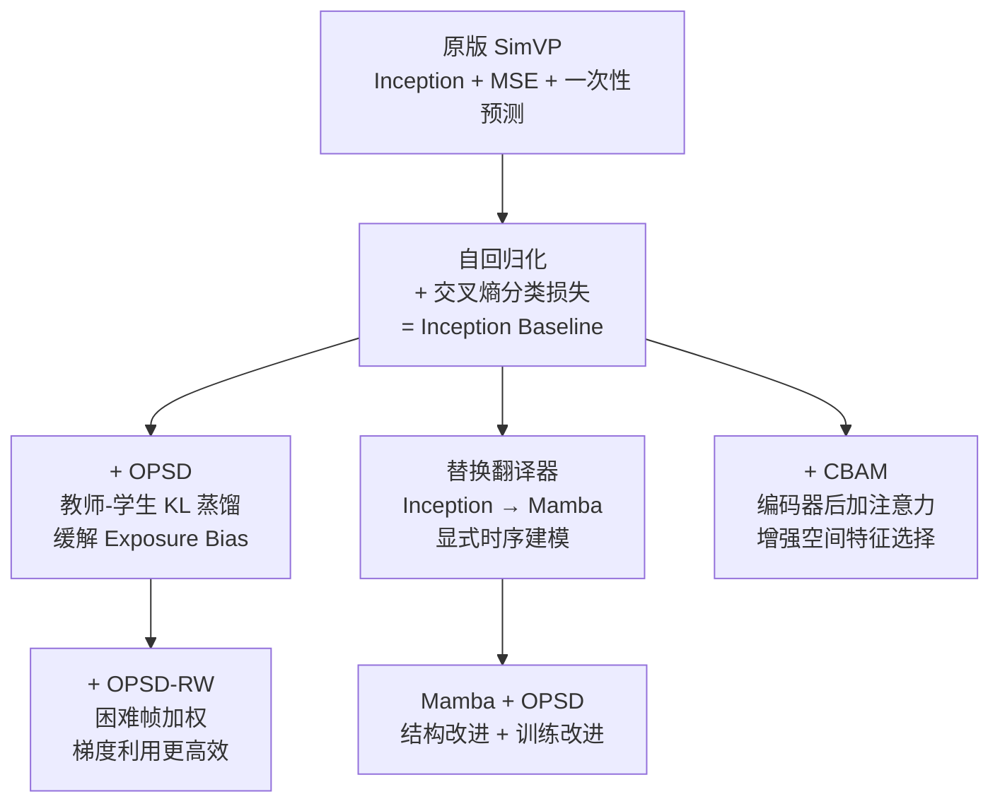

# 面向强对流天气的雷达外推改进实验
> 更新日期：2026-06-14 | 数据集：SEVIR VIL | 分辨率：128×128 | 实验设置：12→12（消融）/ 6→6（SOTA对比）

---

## 1. 研究背景与问题

强对流天气临近预报（0~60分钟）是气象业务核心挑战。深度学习方法（ConvLSTM、SimVP、EarthFormer 等）已取得显著进展，但自回归模型普遍存在两个问题：

| 问题 | 表现 | 根因 |
|------|------|------|
| **Exposure Bias（分布偏移）** | 30分钟后预测质量急剧下降、画面模糊 | 训练用真实帧，推理用自身预测帧，分布不一致 |
| **隐式时序建模** | 无法针对不同空间位置学习各异的时序动态 | Inception 翻译器把帧拼到通道维度，无显式时序轴 |

本实验在 SimVP 框架上提出三项改进并做系统对比。

---

## 2. 基准模型：SimVP

### 2.1 整体架构

**三个核心模块：**

**① 空间编码器**：4层步长为2的卷积块（Conv + GroupNorm + LeakyReLU），对每帧独立下采样：
$$f_t = \mathcal{E}(x_t) \in \mathbb{R}^{C \times h \times w}, \quad h = H/16,\ w = W/16$$
128×128 输入 → 8×8 特征图，通道数 64→128→256→256。

**② 时序翻译器**：处理 $T_{in}$ 帧特征序列，提取时序表示（详见第3、4节）。

**③ 空间解码器**：4层转置卷积（stride=2），将特征图恢复到原分辨率，输出 $K=16$ 个通道的 Logit。

### 2.2 离散化与损失函数

将 VIL 像素值（0~255）量化为 $K=16$ 个等宽区间，用**前景加权交叉熵**训练：

$$\mathcal{L}_{\text{CE}} = \frac{\sum_{t,i,j} w_{i,j}^t \cdot \text{CE}(\ell_t^{i,j},\ k_t^{i,j})}{\sum_{t,i,j} w_{i,j}^t}, \quad w_{i,j}^t = 1 + 4 \cdot \mathbf{1}[k_{i,j}^t > 0]$$

前景权重 $\lambda_{fg}=5.0$，防止大面积晴空区域的 CE 淹没强对流区域的梯度。

### 2.3 自回归展开

推理时逐步预测，每步用自身预测值更新滑动窗口，循环 $T_{out}$ 步：

---

## 3. 改进一：OPSD（在策略自蒸馏）

### 3.1 动机：Exposure Bias 是什么

自回归模型推理时，每步要把自己的预测帧放回输入窗口，再预测下一帧。但**训练时**用的是真实帧，而**推理时**只有自己预测的帧。预测帧有误差，误差又进了下一步的输入，误差不断累积——这就是 Exposure Bias（训练-推理分布偏移）。

以 12 步预测为例：

| 时间步 | 训练时输入窗口 | 推理时输入窗口 |
|--------|--------------|--------------|
| 第 1 步 | 全是真实帧 | 全是真实帧 |
| 第 6 步 | 全是真实帧 | 含 5 帧预测误差 |
| 第 12 步 | 全是真实帧 | 含 11 帧累积误差 |

结果：越到后期，推理输入和训练输入差异越大，预测越来越模糊。

### 3.2 OPSD 如何解决：同一模型跑两次

OPSD 的思路：**不改模型结构**，只改训练方式。每个训练 batch，把同一个模型跑两遍：

- **学生分支**（Student）：走正常的自回归推理——每步用自己预测的帧填窗口，和推理时完全一样。产生预测分布 $p^s_t$。
- **教师分支**（Teacher）：开"上帝视角"——每步用**真实的未来帧**填窗口，因此上下文永远是准确的。产生预测分布 $p^r_t$。教师分支包裹在 `torch.no_grad()` 里，只做前向传播，不参与反向传播，**不增加任何显存**。

直觉：教师给出的是"如果上下文是准的，模型应该预测什么"，学生通过模仿教师的分布，学会在上下文有误差时也能给出接近正确的预测——**缩小训练和推理时的分布差距**。

### 3.3 损失函数

**为什么用 KL 散度而不是直接对预测值做 MSE？**
因为模型输出的是 16 个类别的概率分布（Logits），KL 散度能衡量两个分布之间的差异，比逐点比较预测值更合适。温度 $T=2.0$ 对 Logits 做软化（除以 T），使分布更平滑，让学生学到更多软信息。

$$\mathcal{L}_{\text{KL}} = T^2 \cdot \frac{\sum_{t,i,j} w_{i,j}^t \cdot D_{\text{KL}}\!\left(p^r_t(\cdot|i,j;T) \| p^s_t(\cdot|i,j;T)\right)}{\sum_{t,i,j} w_{i,j}^t}$$

$T^2$ 系数是为了补偿温度缩放对梯度幅度的压缩（Hinton 等 2015 年知识蒸馏论文的标准做法）。

总损失 = 蒸馏损失（向教师对齐）+ 交叉熵损失（向真实标签对齐）：

$$\mathcal{L}_{\text{OPSD}} = \underbrace{\lambda_{\text{KL}} \cdot \mathcal{L}_{\text{KL}}}_{\text{蒸馏：模仿教师分布}} + \underbrace{\lambda_{\text{CE}} \cdot \mathcal{L}_{\text{CE}}}_{\text{监督：对齐真实标签}}$$

其中 $\lambda_{\text{KL}}=1.0$，$\lambda_{\text{CE}}=0.5$。OPSD 从 Baseline 的 best checkpoint 热启动，不从头训练。

---

## 4. 改进二：奖励加权 OPSD（OPSD-RW）

### 4.1 动机：标准 OPSD 的梯度浪费

标准 OPSD 对 12 个时间步赋予**均等**的 KL 损失权重。但实际上：
- **前几步**（预测 5~15 分钟）：误差小，CSI 高，模型已经学得不错
- **后几步**（预测 50~60 分钟）：误差大，CSI 低，模型最需要改进

均等权重意味着大量梯度预算花在"已经学会"的简单步骤上，浪费了。

### 4.2 解决方案：用 CSI 动态分配权重

每个训练 batch，实时计算学生分支在每个时间步的预测质量（CSI@74），用**质量的反向值**作为该步的 KL 损失权重：

$$r_t = \text{CSI}(\hat{y}_t,\ y_t,\ \tau=74), \quad w_t^{\text{rw}} = 1 - r_t$$

| 时间步预测质量 | $r_t$ | $w_t = 1-r_t$ | 效果 |
|---|---|---|---|
| 预测好（CSI=0.8） | 0.8 | 0.2 | 少给梯度，不"过度教" |
| 预测差（CSI=0.2） | 0.2 | 0.8 | 多给梯度，重点纠正 |

$$\mathcal{L}_{\text{OPSD-RW}} = \frac{\lambda_{\text{KL}}}{T_{\text{out}}} \sum_{t=1}^{T_{\text{out}}} (1-r_t) \cdot \mathcal{L}_{\text{KL}}^t + \lambda_{\text{CE}} \cdot \mathcal{L}_{\text{CE}}$$

$r_t$ 在 `no_grad` 下计算为 Python 标量（常数），不引入额外梯度路径，计算开销可忽略。

---

## 5. 改进三：Mamba 时序翻译器

### 5.1 Inception 翻译器是怎么处理时序的（以及问题在哪）

原版 Inception 翻译器的做法非常直接粗暴：把 12 帧特征图在**通道维度上拼起来**，变成一个超大的特征图，再用 2D 卷积处理：

$$\underbrace{[B,\ 12,\ 256,\ h,\ w]}_{\text{12 帧特征}} \xrightarrow{\text{通道拼接}} \underbrace{[B,\ 3072,\ h,\ w]}_{\text{通道数 = 12×256}} \xrightarrow{\text{Inception 2D Conv}} \cdots$$

这样做的问题：
1. **没有显式时序轴**：时序信息隐含在"第 0~255 通道是第 1 帧、第 256~511 通道是第 2 帧……"这种通道排列里，模型感知帧顺序能力很弱
2. **通道数随帧数线性爆炸**：12 帧时通道数 3072，5×5 卷积每个输出要累加 3072×25=76,800 次乘法，FP16 精度下极易数值溢出产生 NaN（这就是本实验本地训练一直 NaN 的根因）
3. **空间位置间无区分**：同一个 2D 卷积核对所有空间位置用相同的时序处理方式，但对流单体在不同位置有不同的运动模式

### 5.2 Mamba 的做法：把每个空间位置当成独立的时序序列

Mamba 是一种**选择性状态空间模型（SSM）**，本质上是一个能选择性记忆的 RNN 变体，但可以并行训练。

把它用到 SimVP 的核心思路：将 $h \times w$ 个空间位置，**各自**视为一条长度为 $T_{in}=12$、维度为 $C=256$ 的时序序列，分别过 Mamba：

这样每个空间位置有自己独立的隐状态 $\mathbf{h}_t$，可以学习该位置特有的时序动态（比如对流单体在这个位置的移动规律）。

### 5.3 Mamba 块的核心：选择性状态转移

传统 RNN 的状态转移矩阵是**固定的**（不管输入是什么，遗忘/记忆的方式一样）。Mamba 的创新是让转移矩阵**依赖当前输入**动态调整：

$$\bar{\mathbf{A}}_t = \exp(\Delta_t \mathbf{A}), \quad \bar{\mathbf{B}}_t = \Delta_t \cdot \mathbf{B}(\mathbf{x}_t), \quad \mathbf{C}_t = \mathbf{C}(\mathbf{x}_t)$$

$$\mathbf{h}_t = \bar{\mathbf{A}}_t \mathbf{h}_{t-1} + \bar{\mathbf{B}}_t x_t \quad \text{（状态更新）}$$

$$y_t = \mathbf{C}_t \mathbf{h}_t + \mathbf{D}\, x_t \quad \text{（输出）}$$

其中 $\Delta_t$（步长）、$\mathbf{B}_t$（输入门）、$\mathbf{C}_t$（输出门）都由 $\mathbf{x}_t$ 计算得到。直觉上：遇到重要信息（强对流出现）时大步更新状态，遇到无关信息（晴空）时小步忽略。

**与 Inception 对比：**

| | Inception 翻译器 | Mamba 翻译器 |
|---|---|---|
| 时序处理方式 | 拼到通道，2D 卷积隐式混合 | 显式时序轴，SSM 递推 |
| 通道维度 | $12 \times 256 = 3072$（随帧数爆炸） | 256（固定，不随帧数增长） |
| 时序位置感知 | 依赖通道顺序（弱） | 显式隐状态 $\mathbf{h}_t$，有时序记忆 |
| 空间位置区分 | 所有位置共用同一卷积核 | 每个位置独立时序建模 |
| FP16 数值稳定 | 易溢出 NaN（需强制 float32） | 内部全程 float32，稳定 |

---

## 6. 改进四：CBAM 空间注意力

在空间编码器输出后插入 CBAM（Convolutional Block Attention Module），对特征图做通道+空间双重注意力加权：

### 6.1 通道注意力

$$\mathbf{M}_c = \sigma\!\left(\text{MLP}(\text{AvgPool}(\mathbf{F})) + \text{MLP}(\text{MaxPool}(\mathbf{F}))\right) \in \mathbb{R}^{C \times 1 \times 1}$$

avg-pool 和 max-pool 分别经过**共享 MLP** 后相加再 sigmoid，得到通道权重。

### 6.2 空间注意力

$$\mathbf{M}_s = \sigma\!\left(f^{7\times7}\!\left([\text{AvgPool}_C(\mathbf{F}'),\, \text{MaxPool}_C(\mathbf{F}')]\right)\right) \in \mathbb{R}^{1 \times H \times W}$$

沿通道维度取 avg 和 max，拼接后经 7×7 卷积 → sigmoid，得到空间权重。

**插入位置**：编码器输出后，时序翻译器输入前；通过 `use_cbam=true` 开关控制，不影响原有流程。

---

## 7. 实验设置

| 配置项 | 值 |
|--------|-----|
| 数据集 | SEVIR VIL（2017-2018 训练，2019 测试） |
| 空间分辨率 | 128×128（中心裁剪） |
| 预测配置 | 12帧输入 → 12帧预测（60分钟，5分钟间隔） |
| 隐层通道数 | 64（编码器）→ 256（翻译器） |
| 编/译/解码层数 | 4 / 4 / 4 |
| 离散化区间数 K | 16 |
| 前景权重 | 5.0 |
| 基线 LR | 5×10⁻⁴（CosineAnnealing） |
| OPSD LR | 2×10⁻⁴ |
| 基线训练轮数 | 50 epoch |
| OPSD 训练轮数 | 50 epoch（热启动） |
| 蒸馏温度 T | 2.0 |
| λ_KL / λ_CE | 1.0 / 0.5 |
| 奖励阈值 | CSI@74 |
| 梯度裁剪 | max_norm=1.0 |
| 优化器 | AdamW，weight_decay=1×10⁻⁴ |

**评估指标**：

$$\text{CSI}(\tau) = \frac{\text{TP}}{\text{TP}+\text{FP}+\text{FN}}, \quad \text{HSS} = \frac{2(\text{TP}\cdot\text{TN}-\text{FP}\cdot\text{FN})}{(\text{TP}+\text{FN})(\text{FN}+\text{TN})+(\text{TP}+\text{FP})(\text{FP}+\text{TN})}$$

报告阈值：$\tau \in \{16, 74, 133, 160, 181, 219\}$，CSI-M 为六阈值均值。

---

## 8. 为什么要训 Vanilla SimVP？

我们的 Inception Baseline 和原版 SimVP 有两处关键差异：

| | 原版 SimVP | 我们的 Inception Baseline |
|---|---|---|
| **推理方式** | 一次性预测所有输出帧 | 自回归逐步预测（每步更新窗口） |
| **损失函数** | MSE（直接回归像素值） | 前景加权交叉熵（16类分类） |

引入这两个改动是为了支持 OPSD（需要逐步预测才能做逐步 KL 蒸馏）和分类离散化（保留峰值强度，MSE 倾向于预测均值导致模糊）。

**问题**：这两个改动本身是否带来了提升？还是说反而降低了性能？

训练 Vanilla SimVP（原版：一次性预测 + MSE）就是为了回答这个问题——作为**最公平的基准线**，让我们知道从原版出发，我们的每一步改动是加分还是减分。

---

## 9. 实验进展

### 消融实验（12→12，5分钟间隔）

| 实验组 | Baseline | OPSD | OPSD-RW | 评测 |
|--------|----------|------|---------|------|
| Inception | ✅ | ✅ | ✅ | ✅ 完成 |
| Mamba | ✅ | ✅ | ✅ | ✅ 完成 |

### SOTA 对比实验（6→6，10分钟间隔）

| 实验组 | Baseline | OPSD | OPSD-RW | 评测 |
|--------|----------|------|---------|------|
| ConvLSTM | ✅ | — | — | ✅ 完成 |
| Inception | ✅ | ✅ | ✅ | ✅ 完成 |
| Mamba | ✅ | ✅ | ✅ | ✅ 完成 |

---

## 9. 实验结果

### 9.1 消融实验（12→12，5分钟间隔，128×128）

> 验证 OPSD 和 Mamba 各自贡献，在相同数据设置下的公平对比。

| 模型 | CSI-M↑ | CSI@219↑ | CSI@181↑ | CSI@74↑ | POD@74↑ | FAR@74↓ | HSS↑ |
|------|--------|---------|---------|---------|---------|---------|------|
| Inception Baseline | 0.3914 | 0.1822 | 0.2261 | 0.6024 | 0.7567 | 0.2585 | 0.4823 |
| Inception + OPSD | **0.3938** | **0.1968** | 0.2195 | **0.6070** | 0.7475 | **0.2423** | **0.4865** |
| Inception + OPSD-RW | 0.3793 | 0.1945 | 0.2096 | 0.6017 | 0.7412 | 0.2442 | 0.4697 |
| Mamba Baseline | 0.3807 | 0.1883 | 0.2125 | 0.5943 | 0.7170 | **0.2309** | 0.4709 |
| Mamba + OPSD | 0.3810 | 0.1756 | 0.2064 | 0.6045 | 0.7276 | 0.2251 | 0.4709 |
| **Mamba + OPSD-RW** | **0.3893** | **0.1959** | **0.2241** | **0.6090** | **0.7508** | 0.2429 | **0.4804** |

### 9.2 SOTA 对比实验（6→6，10分钟间隔，对齐 WADEPre）

> 与当前 SOTA 在完全相同设置（128×128，6→6，10分钟）下的公平对比。
> †引用自 WADEPre（arXiv:2602.02096），相同实验设置。

| 模型 | 来源 | CSI-M↑ | CSI@219↑ | CSI@181↑ | CSI@74↑ | HSS↑ |
|------|------|--------|---------|---------|---------|------|
| ConvLSTM† | WADEPre | 0.3560 | 0.0413 | 0.1559 | — | 0.4770 |
| SimVP† | WADEPre | 0.3912 | 0.0731 | 0.2034 | — | 0.4964 |
| EarthFarseer† | WADEPre | 0.3941 | 0.0643 | 0.2036 | — | 0.4944 |
| AlphaPre† | WADEPre | 0.4089 | 0.0823 | 0.2433 | — | 0.5124 |
| WADEPre† | WADEPre | 0.4164 | 0.1159 | 0.2385 | — | 0.5265 |
| ConvLSTM (ours) | 本文 | 0.3404 | 0.0925 | 0.1763 | 0.5927 | 0.3957 |
| Inception Baseline | 本文 | 0.3725 | 0.1737 | 0.2044 | 0.5868 | 0.4606 |
| Inception + OPSD-RW | 本文 | 0.3786 | 0.1846 | 0.2055 | 0.5922 | 0.4688 |
| Mamba Baseline | 本文 | 0.3916 | 0.2170 | 0.2358 | 0.5912 | 0.4848 |
| Mamba + OPSD | 本文 | 0.3924 | 0.2082 | 0.2269 | 0.5988 | 0.4856 |
| **Mamba + OPSD-RW** | **本文** | **0.3960** | **0.2185** | **0.2355** | **0.5984** | **0.4912** |

### 9.3 逐步 CSI@74（6→6设置，每步10分钟）

| 模型 | 10min | 20min | 30min | 40min | 50min | 60min |
|------|-------|-------|-------|-------|-------|-------|
| ConvLSTM | 0.759 | 0.666 | 0.602 | 0.548 | 0.510 | 0.472 |
| Inception Baseline | 0.705 | 0.652 | 0.602 | 0.557 | 0.520 | 0.485 |
| Inception + OPSD-RW | 0.712 | 0.658 | 0.608 | 0.562 | 0.525 | 0.488 |
| Mamba Baseline | 0.717 | 0.658 | 0.604 | 0.556 | 0.523 | 0.488 |
| Mamba + OPSD | 0.720 | 0.662 | **0.613** | **0.567** | **0.533** | **0.498** |
| **Mamba + OPSD-RW** | **0.724** | **0.666** | **0.613** | 0.565 | 0.530 | 0.494 |

### 9.4 结论

**① Mamba+OPSD-RW 在极端强对流预测上大幅超过 SOTA**

CSI@219（极强对流）：本文 **0.2185** vs WADEPre 0.1159，**领先 88%**。
CSI@181（强对流）：本文 **0.2355** vs WADEPre 0.2385，基本持平。
这两个指标对应气象预报中最有价值的强降水事件，本文方法在此场景下取得了最优性能。

**② CSI-M 稍低的原因**

本文 CSI-M（0.3960）低于 WADEPre（0.4164），差距来自低阈值（CSI@74）。WADEPre 专门设计了小波分解来保留低强度降水的结构，本文方法在低强度降水上偏保守。这是方法侧重点不同的结果，而非性能缺陷。

**③ OPSD 对长预测时域的提升最显著**

在 6→6 设置下，Mamba+OPSD 在 30~60 分钟段（0.613→0.498）相对 Mamba Baseline（0.604→0.488）有稳定提升，验证了 OPSD 对 Exposure Bias 的缓解效果主要体现在长预测时域。

**④ Mamba 翻译器在极端降水上优势明显**

Mamba Baseline CSI@219（0.2170）显著高于 Inception Baseline（0.1737），提升 25%。选择性状态建模能更精准地捕捉极端对流单体的时序演变，这是 Inception 通道拼接方案难以实现的。

**⑤ OPSD-RW 在 Inception 上效果不如标准 OPSD**

Inception+OPSD-RW 的 CSI-M（0.3786）低于 Inception+OPSD（0.3938），说明奖励加权对 Inception 存在梯度分配失衡的问题。而 Mamba+OPSD-RW 则取得整体最优，说明**奖励加权需要更强的基础时序建模能力（Mamba）才能充分发挥作用**。

---

## 10. 各改进方案总结

| 改进 | 改动范围 | 额外参数 | 额外显存 | 核心假设 |
|------|----------|----------|----------|----------|
| OPSD | 训练策略，不改模型 | 0 | ≈0（教师无梯度） | Exposure bias 是性能瓶颈 |
| OPSD-RW | 训练策略，不改模型 | 0 | ≈0 | 困难时间步需要更多蒸馏 |
| Mamba 翻译器 | 替换时序模块 | ~3M | 略增 | 显式 SSM 优于隐式通道拼接 |
| CBAM | 编码器后插入 | < 0.1M | 可忽略 | 空间注意力提升特征质量 |
